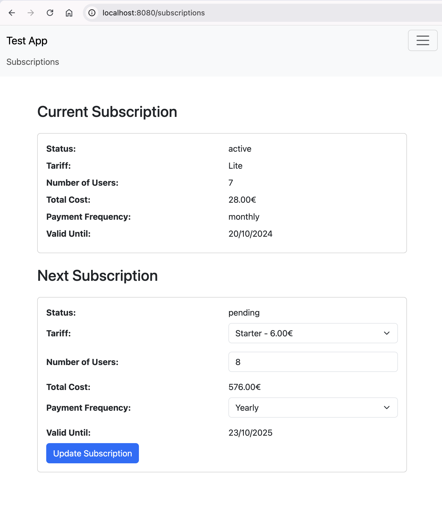

# Subscriptions тестове завдання
Установка:
```
composer install
php artisan migrate --seed
php artisan l5-swagger:generate
```
Запуск фронта:
```
npm i
npm run dev
```
Лінки:

[http://localhost:8080/subscriptions](https://localhost:8080/subscriptions)
[http://localhost:8080/api/documentation](http://localhost:8080/api/documentation)

Вигляд проекту:

API:

